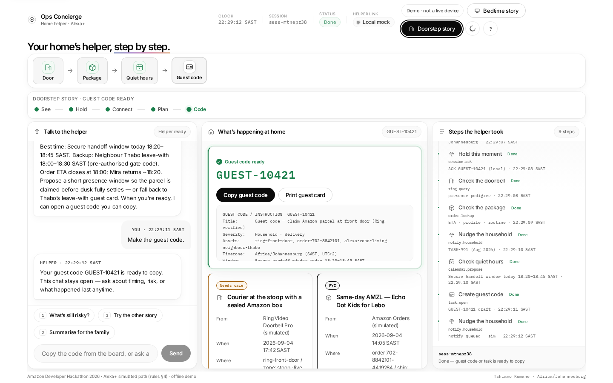

# Ops Concierge



> *Light home-helper restraint — pure white canvas, near-black type, vast whitespace — with a first-class dark theme. Not a mission-control dashboard.*

Session-stateful, agentic **Amazon household helper** for the **Amazon Developer Hackathon 2026** — **Alexa+ simulated path** (Official Rules §4).

**Author:** Tshiamo Komane (South Africa) — builds agentic household workflows with Alexa+, Ring, and Fire TV in mind.

This is **not** a live Alexa skill, not a single-turn Q&A bot, and **not** connected to live Ring, Amazon Orders, or Fire TV. Everything is mocked in the browser so judges can see **orchestration**: ingest a Ring package event + Amazon delivery expectation (or Fire TV bedtime stall), acknowledge, correlate with household calendar, propose a SAST quiet-hours window, and open a copyable **guest code** or **bedtime task**.

## Vision

Households need a **home helper** that holds the moment in session, orchestrates Ring / Orders / calendar / notify / task-shaped tools, and speaks like a trusted Alexa+ companion — not a forgetful chatbot.

## Run

```bash
cd ops-concierge
python3 -m http.server 8765
```

Open [http://127.0.0.1:8765/](http://127.0.0.1:8765/).  
Or: `python3 serve.py` (same port, CSP + security headers on).

## Product surface / what judges should see

1. Light cinematic shell (theme toggle → dark): compact nav, airy hero, SAST clock, session ID, phase pill, **SIMULATION · NOT A LIVE ALEXA DEVICE**, Helper link (Local mock / Connected / Offline).
2. Click **Doorstep story** or press **D** (Ring + Amazon parcel → guest code).
3. Follow suggestions: Got it → Connect the dots → Quiet hours → Make the guest code.
4. Tools timeline fires Amazon-native mocks: `ring.query`, `order.lookup`, `session.ack`, `calendar.propose`, `notify.household`, `task.open`.
5. Board shows signals, correlation, window, and artefact **GUEST-10421** (Copy / Print guest card).
6. Optional: **Bedtime story** or press **B** (Fire TV Kids + Alexa routine → **TASK-22018**). Mid-story switch is guided; session does not re-ask from scratch within a story.

Keyboard: Enter send, 1–4 suggestions, D doorstep, B bedtime, ? shortcuts. See [DEMO.md](DEMO.md) for a ≤3 minute click-path.

## Alexa+ simulated path mapping (Rules §4)

| Requirement | How this project meets it |
|-------------|---------------------------|
| Simulated Alexa+ web experience | Talk-to-helper pane + status tag; explicit simulation badge |
| Working demo | Fully client-side mock; one-command static server |
| Agentic / not obvious Q&A | Multi-tool orchestration with visible timeline and session phases |
| Public source + OSI license | MIT ([LICENSE](LICENSE)); publish to public GitHub when approved |

## Mocked (intentionally)

Ring doorbell / package zones, Amazon order ETA, household calendar + quiet hours, Fire TV kids profile, Alexa bedtime routine, similar household tasks, guest/task cards, speech/TTS.

No API keys, no AWS credits required for this path.

## MCP server (optional, local)

Self-hosted **MCP Streamable HTTP** server for the six Amazon-native tools (`ring.query` … `task.open`). Spec: [`specs/002-mcp-streamable-http/`](specs/002-mcp-streamable-http/). How-to: [`docs/MCP.md`](docs/MCP.md).

```bash
uv sync --extra dev
uv run python -m mcp_server          # http://127.0.0.1:8766/mcp
uv run pytest -q
```

Static demo stays offline. To prefer the live JSON bridge when MCP is up: `localStorage.setItem('OPS_USE_MCP','1')` then reload (CSP localhost connect already set for port 8766).

## Architecture

Static, zero-build. `escapeHtml` on all dynamic text. CSP enforced by `serve.py` headers (matched meta in `index.html`); optional `_headers` for Cloudflare-style hosts — GitHub Pages lacks custom headers (see SECURITY.md). `script-src 'self'` only — **no unsafe-inline scripts**. Fonts: Inter + IBM Plex Mono (`display=swap`); premium system-ui / ui-monospace fallbacks if Google Fonts is blocked.

- `index.html`, `css/app.css`, `js/app.js`, `js/scenarios.js`, `favicon.svg`, `icon-*.svg`, `manifest.webmanifest`
- `DEMO.md`, `FRICTION_LOG.md`, `PRODUCT_FEEDBACK.md`, `CONTRIBUTING.md`, `SECURITY.md`
- `LICENSE` — MIT, Copyright (c) 2026 Tshiamo Komane
- Design: pure white canvas + intentional dark theme, pill controls, thin borders, helper vocabulary (Doorstep / Bedtime / Guest code / Quiet hours)

## DevOps / Live demo

- **Live demo (GitHub Pages):** https://tkomane.github.io/ops-concierge/ — enable once under **Settings → Pages → Source: GitHub Actions**, then pushes to `main` deploy via [`.github/workflows/pages.yml`](.github/workflows/pages.yml).
- **CI:** [`.github/workflows/ci.yml`](.github/workflows/ci.yml) checks required files, HTML asset references, and a local HTTP smoke.
- Details: [docs/DEVOPS.md](docs/DEVOPS.md) · architecture: [docs/ARCHITECTURE.md](docs/ARCHITECTURE.md) · security: [SECURITY.md](SECURITY.md)
